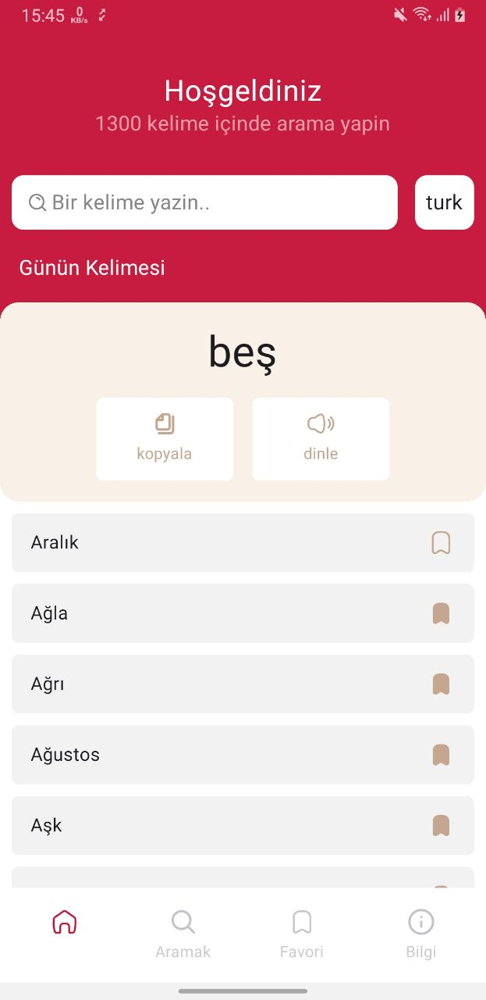
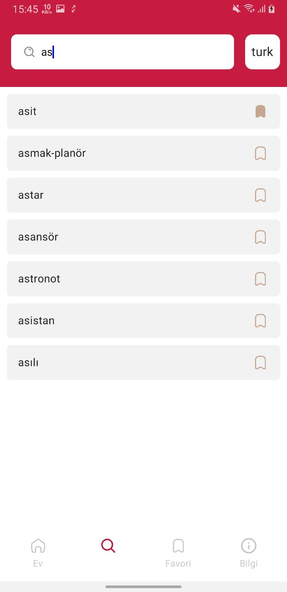
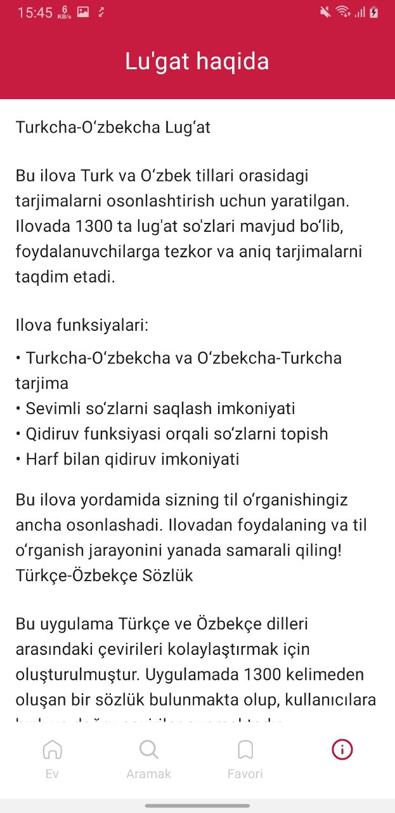

# Uzbek - Turkish Dictionary

Uzbek-Turkish Dictionary is a modern Android application that helps users translate words from Uzbek to Turkish. The app is built using Jetpack Compose, follows the MVI architecture, and includes features such as text-to-speech, clipboard copy, and local word storage using Room.

# 📌 Key Features:
📖 Word Translation: Quickly and accurately translates words from Uzbek to Turkish.

🔊 Text to Speech: Allows users to listen to the correct pronunciation of translated words.

📋 Clipboard Copy: Users can easily copy translations with a single tap.

🧠 MVI Architecture: The app is designed using the Model-View-Intent architecture for better state management and scalability.

🎨 Jetpack Compose UI: The entire user interface is built using Jetpack Compose for a smooth and modern look.

🧭 Bottom Navigation: Seamless navigation between different sections of the app.

💾 Room Database: Stores all dictionary data locally for fast and offline access.

# 🛠 Technologies Used:

Technology	Purpose

Jetpack Compose	For building modern and declarative UI

Room Database	For offline storage of dictionary data

Text to Speech	To read out the words with correct pronunciation

Clipboard Manager	To copy text content easily

Bottom Navigation	For switching between main sections of the app

MVI Pattern	For maintaining a clean and structured app architecture

#

  
  
  
  

# 🚀 Running the Project
Download the APK and try it out.

Author: [Hasanov Jahongir]

Contact: [jahonh959@gmail.com]
